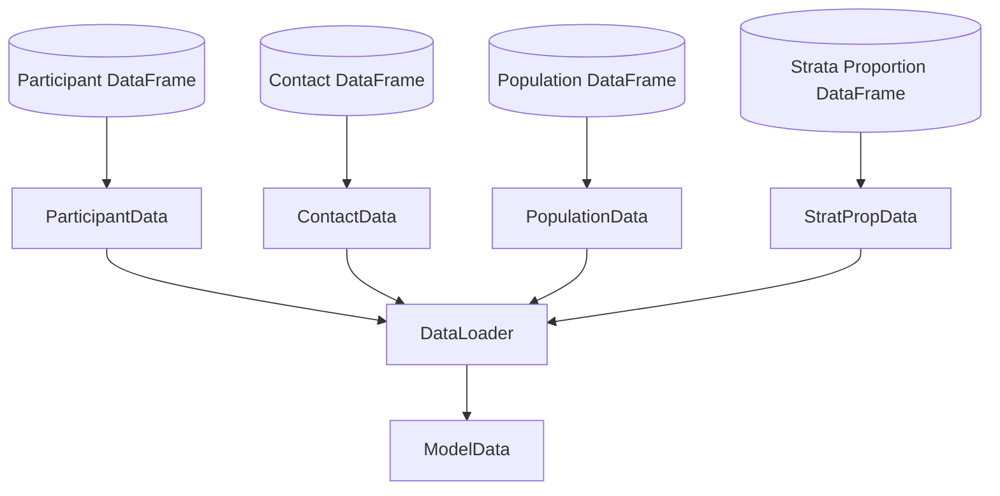
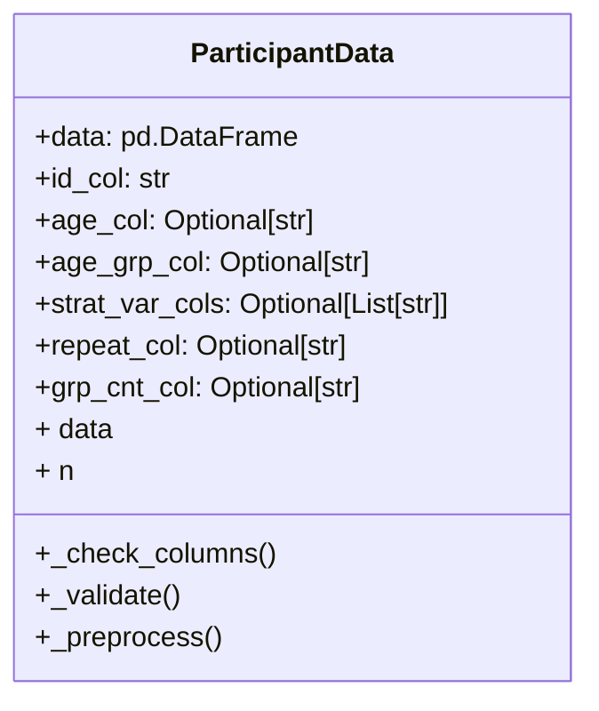
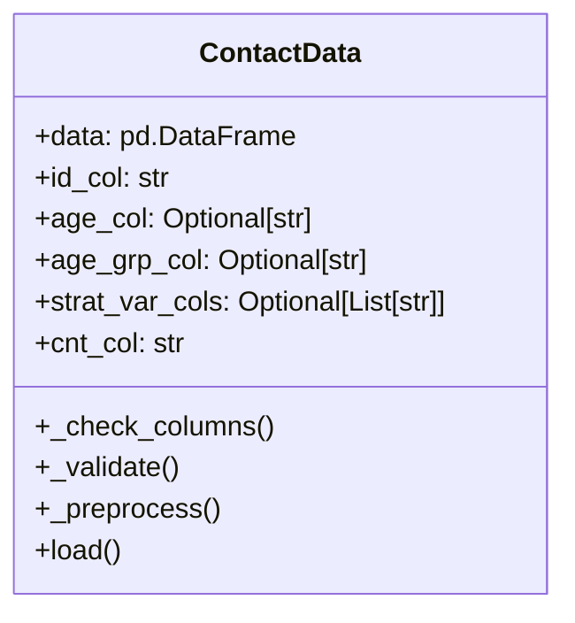
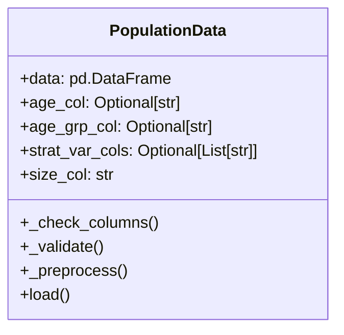
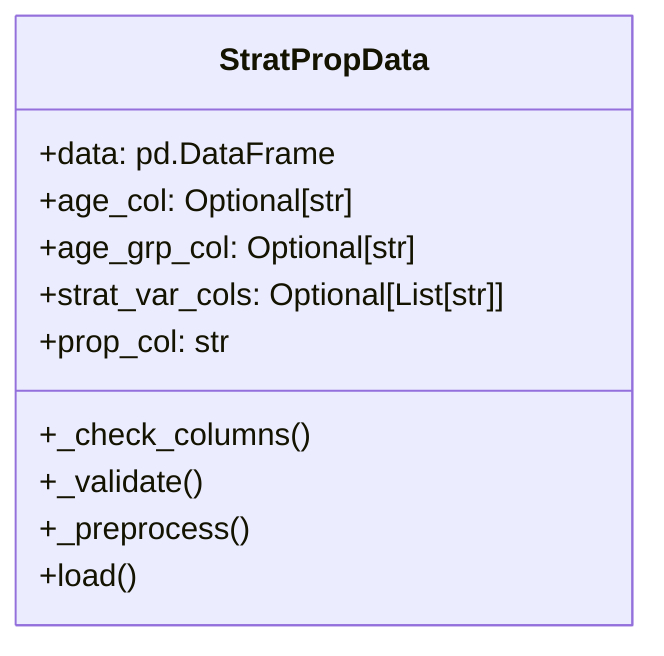
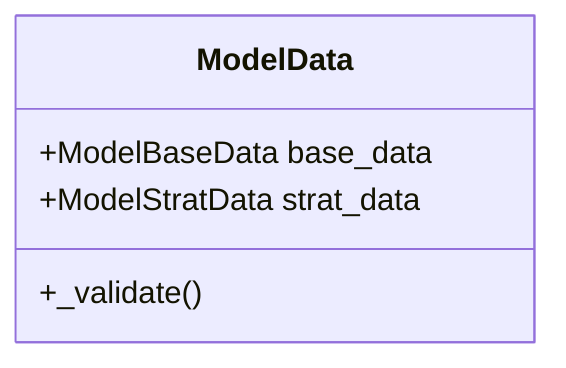
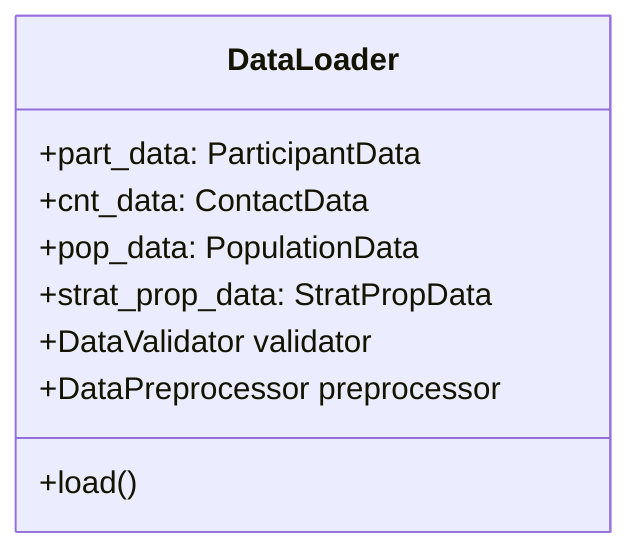
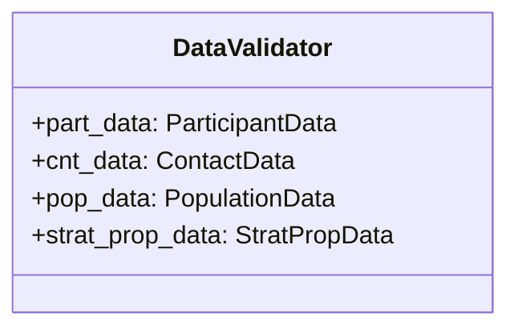
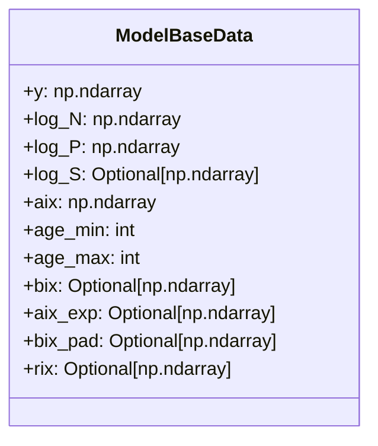

# Dev Docs

**Document Version**: 1.0  
**Date**: December 3, 2025  
**Author**: Shozen Dan  
**Status**: Design Review

---

This document contains the internal documentation for `cntmosaic`. It is intended for developers and contributors to the project. The document outlines the design and architecture of the codebase, providing insights into the various components and their interactions.

## Design Philosophy


## 1. Architecture

### 1.1 High-Level Design

## Input

We start by clearly defining the expected structure of the input data. We assume that the **user have 4 `pandas` DataFrames** representing participant data, contact data, population data, and strata proportion data. In total, there are four possible scenarios:

1. **No Stratification**: This is the simplest case where only age is used for stratification.
    In this case, both participant, contact, and population data contain only age columns. The schema for each dataframe is as follows:
    - Participant Data: `['id', 'age_part', '(repeat)', '(grp_cnt)']`
    - Contact Data: `['id', 'age_cnt', 'y']`
    - Population Data: `['age', 'P']`
    - Strata Proportion Data: Not required.
Note that `(repeat)` and `(grp_cnt)` are optional columns representing participant repeat interview/participation counts and group contact counts respectively.
2. **Single Variable Stratification (Partial)**:
    We stratify by a single variable (e.g., gender, setting) that is only observed for participants. The schema for each dataframe is as follows:
    - Participant Data: `['id', 'age_part', '(strat_var)', '(repeat)', '(grp_cnt)']`
    - Contact Data: `['id', 'age_cnt', 'y']`
    - Population Data: `['age', 'P']`
    - Strata Proportion Data: `['age', '(strat_var)', 'prop']`
3. **Single Variable Stratification (Full)**:
    We stratify by a single variable (e.g., gender, setting) that is observed for both participants and contacts. The schema for each dataframe is as follows:
    - Participant Data: `['id', 'age_part', '(strat_var)', '(repeat)', '(grp_cnt)']`
    - Contact Data: `['id', 'age_cnt', '(strat_var)', 'y']`
    - Population Data: `['age', '(strat_var)', 'P']`
    - Strata Proportion Data: `['age', '(strat_var)', 'prop']`
4. **Multiple Variable Stratification (Partial)**:
    We stratify by multiple variables (e.g., gender, setting) that are only observed for participants. The schema for each dataframe is as follows:
    - Participant Data: `['id', 'age_part', '(strat_var1)', '(strat_var2)', ..., '(repeat)', '(grp_cnt)']`
    - Contact Data: `['id', 'age_cnt', 'y']`
    - Population Data: `['age', 'P']`
    - Strata Proportion Data: `['age', '(strat_var1)', '(strat_var2)', ..., 'prop']`
5. **Multiple Variable Stratification (Full)**:
    We stratify by multiple variables (e.g., gender, setting) that are observed for both participants and contacts. The schema for each dataframe is as follows:
    - Participant Data: `['id', 'age_part', '(strat_var1)', '(strat_var2)', ..., '(repeat)', '(grp_cnt)']`
    - Contact Data: `['id', 'age_cnt', '(strat_var1)', '(strat_var2)', ..., 'y']`
    - Population Data: `['age', '(strat_var1)', '(strat_var2)', ..., 'P']`
    - Strata Proportion Data: `['age', '(strat_var1)', '(strat_var2)', ..., 'prop']`
6. **Multiple Variable Stratification (Mixed)**:
    We stratify by multiple variables where some are observed for both participants and contacts (FULL mode) and others only for participants (PARTIAL mode). The schema for each dataframe is as follows:
    - Participant Data: `['id', 'age_part', '(strat_var1)', '(strat_var2)', '(strat_var3)', ..., '(repeat)', '(grp_cnt)']`
    - Contact Data: `['id', 'age_cnt', '(strat_var1)', '(strat_var3)', ..., 'y']`
    - Population Data: `['age', '(strat_var1)', '(strat_var3)', ..., 'P']`
    - Strata Proportion Data: `['age', '(strat_var1)', '(strat_var2)', '(strat_var3)', ..., 'prop']`
    Note that in this scenario, `(strat_var1)` and `(strat_var3)` are FULL mode variables, while `(strat_var2)` is a PARTIAL mode variable. Additionally, population counts are only needed for the FULL mode variables. 


> 📕 We make the explicit choice of providing the population data separately from strata proportions data because it may not always be possible to have joint population counts for all the strata combinations. This separation allows the users to separately prepare the population size and population proportions.

### Additional assumptions on the input data
- If continous age is provided, it is assumed to be in integers (or something that can be converted to integers without loss of information) and non-negative.
- If age groups are provided, it is assumed that they are (1) ordered categorical variables and (2) each age group is if `pandas.Interval` type closed on the left and open on the right, i.e., `[a, b)`.
- Stratification variables are assumed to be ordered categorical variables.

## Input Handling

### Input Handling Architecture

The following diagram illustrates the overall architecture for the input data handling process:


### `ParticipantData` Container

The role of the `ParticipantData` container class is to validate and preprocess the participant data. 



Specifically,

**Checks** the existance of the necessary columns in the data
- `id`: Unique participant identifiers
- `age_part`: Continuous age of the participant
- `age_grp_part`: Alternatively the age group of the participant
- `(strat_vars)`: Stratification variables if specified
- `repeat`: Repeat interview/participation counts if specified
- `grp_cnt`: Group contact counts if specified

**Validation**
- Participant ID Uniqueness: Ensures that the participant IDs are unique within the participant dataframe.
- Age Value Checks: Validates that the age values are non-negative integers if continuous age is provided.
- Age Group Checks: Validates that age group values are of type `pandas.Interval` and are ordered categorical variables if age groups are provided.
- Stratification variables are checked to ensure that they are ordered categorical variables if provided.
- Repeat values are checked to ensure they are non-negative integers if provided.
- Group contact counts are checked to ensure they are non-negative finite integers if provided.

**Preprocessing**
- Rename the participant ID column to `id` if not already `id`.
- Rename the age or age group column names to `age_part` or `age_grp_part` if not already.
- Rename any specified stratification column to `(strat_var)_part` if not already. This is to prevent confusion with columns in the contact dataframe
- Rename the repeat and group contact count columns to `repeat` and `grp_cnt` if not already.

The user facing API is as follows:
```python
from cntmosaic.dataloader import ParticipantData

part_data = ParticipantData(
    data=df_part,
    id_col='id',       # Column name for participant ID
    age_col='age',     # (Optional) Column name for participant age
    age_grp_col=None,  # (Optional) column name for participant age group
    strat_var_cols=['gender', 'setting'],  # (Optional) List of stratification variable column names
    repeat_col=None,  # (Optional) Column name for participant repeat counts
    grp_cnt_col=None  # (Optional) Column name for group contact counts
)
```

### `ContactData` Container
The role of the `ContactData` container class is to validate and preprocess the contact data.



**Checks** the existance of the necessary columns in the data

- `id`: Unique participant identifiers
- `age_cnt`: Continuous age of the contact
- `age_grp_cnt`: Alternatively the age group of the contact
- `(strat_vars)`: Stratification variables if specified
- `y`: The number of contacts

**Validation**

- Age Value Checks: Validates that the age values are non-negative integers if continuous age is provided.
- Age Group Checks: Validates that age group values are of type `pandas.Interval` and are ordered categorical variables if age groups are provided.
- Stratification variables are checked to ensure that they are ordered categorical variables if provided.
- Contact counts are checked to ensure they are non-negative finite integers.

**Preprocessing**

- Rename the ID column to `id` if not already `id`.
- Rename the age or age group column names to `age_cnt` or `age_grp_cnt` if not already.
- Rename any specified stratification column to `(strat_var)_cnt` if not already. This is to prevent confusion with columns in the participant dataframe
- Rename the contact count column to `y` if not already

The user facing API is as follows:
```python
from cntmosaic.dataloader import ContactData

cnt_data = ContactData(
    data=df_cnt,
    id_col='id',       # Column name for participant ID
    age_col='contact_age',     # (Optional) Column name for contact age
    age_grp_col=None,  # (Optional) column name for contact age group
    strat_var_cols=['gender_cnt', 'setting_cnt'],  # (Optional) List of stratification variable column names
    cnt_col='y'  # Column name for contact counts
)
```

### `PopulationData` Container

The role of the `PopulationData` container class is to validate and preprocess the contact data.



**Checks** the necessary columns are present in the data

- `age_pop`: Continuous age of the contact
- `age_grp_pop`: Alternatively the age group of the contact
- `(strat_vars)`: Stratification variables if specified
- `P`: The population counts

**Validation**

- Age Value Checks: Validates that the age values are non-negative integers if continuous age is provided.
- Age Group Checks: Validates that age group values are of type `pandas.Interval` and are ordered categorical variables if age groups are provided.
- Stratification variables are checked to ensure that they are ordered categorical variables if provided.
- Population counts are checked to ensure they are non-negative and non-zero finite integers.

**Preprocessing**

- Rename the age or age group column names to `age_pop` or `age_grp_pop` if not already.
- Rename any specified stratification column to `(strat_var)_pop` if not already. This is to prevent confusion with columns in the participant dataframe
- Rename the contact count column to `P` if not already

The user facing API is as follows:
```python
from cntmosaic.dataloader import PopulationData

pop_data = PopulationData(
    data=df_pop,
    age_col='age',     # (Optional) Column name for contact age
    age_grp_col=None,  # (Optional) column name for contact age group
    strat_var_cols=['gender', 'setting'],  # (Optional) List of stratification variable column names
    size_col='P'  # Column name for population counts
)
```

### `StratPropData` Container

The role of the `StratPropData` container class is to validate and preprocess the strata proportions data.



**Checks** the necessary columns are present in the data
- `age`: Continuous age of the contact
- `age_grp`: Alternatively the age group of the contact
- `(strat_vars)`: Stratification variables if specified
- `prop`: The population proportions

**Validation**
- Age Value Checks: Validates that the age values are non-negative integers if continuous age is provided.
- Age Group Checks: Validates that age group values are of type `pandas.Interval` and are ordered categorical variables if age groups are provided.
- Stratification variables are checked to ensure that they are ordered categorical variables if provided.
- Proportion values are checked to ensure they are between 0 and 1.

**Preprocess**
- Rename the age or age group column names to `age` or `age_grp`
- Rename any specified stratification column to `(strat_var)` if not already. This is to prevent confusion with columns in the participant dataframe
- Rename the proportion column to `prop` if not already

The user facing API is as follows:
```python
from cntmosaic.dataloader import StratPropData

strat_prop_data = StratPropData(
    data=df_strat_prop,
    age_col='age',     # (Optional) Column name for contact age
    age_grp_col=None,  # (Optional) column name for contact age group
    strat_var_cols
    =['gender', 'setting'],  # (Optional) List of stratification variable column names
    prop_col='prop'  # Column name for population proportions
)
```

### `DataLoader` Class

The goal of the `DataLoader` class is the consolidate the various input data and create an instance of the `ModelData` class that is then passed to the models. 

It is helpful to have an outline of the `ModelData` class before going into the details of the `DataLoader` class. The `ModelData` class is a container that holds all the necessary data required by the models. 



The two main components of the `ModelData` class are:

- `ModelBaseData`: This component holds the basic data required for modelling, including:
    - Contact counts `y` (np.ndarray)
    - Participant age indices `aix` (np.ndarray)
    - Log sample size counts `log_N` (np.ndarray)
    - Log population counts `log_P` (np.ndarray)
    - (Situational) Contact age indices `bix` (np.ndarray)
    - (Situational) Log group contact offsets `log_S` (np.ndarray)
    - (Situational) Participant repeat counts `rix` (np.ndarray)
    - (Situational) Expanded participant age indices `aix_exp` (np.ndarray)
    - (Situational) Padded contact age indices `bix_pad` (np.ndarray)

- `ModelStratData`: This component holds the stratification data required for modelling, including:
    - Stratification modes for each variable (Dict[str, StratMode])
    - Number of categories for each stratification variable (Dict[str, int])
    - Stratification variable indices for each observation (Dict[str, np.ndarray])
    - Flat index combining all stratification variable indices (np.ndarray)
    - Reverse mapping from flat index back to individual variable categories (Dict[int, List[int]])

Below is the class diagram for the `DataLoader` class:



Specifically, the `DataLoader` class takes in instances of the `ParticipantData`, `ContactData`, `PopulationData`, and `StratPropData` performs the following tasks:

#### Validation

The `DataValidator` class is responsible for validating various aspects of the input data to ensure consistency and correctness before proceeding to the data preparation stage.



Specifically, it validates the following:
- Checks that `part_data`, `cnt_data`, `pop_data`, and `strat_prop_data` are instances of their respective classes.
- Validates the consistency of stratification variables across all DataFrames.

TODO: For robustness and modularity, we should factor out the validation logic into a separate validation module.

**Age info type validation**

The age information in contact studies can be either continuous age or age groups. In general, there are three possible modelling scenarios:

1. **Fully coarse age models**: Models such as `SocialMix` and `Prem` take in only age groups for both participants and contacts. Additionally, for reciprocity adjustment, population data must also be in age groups. We can generalise our statistical framework to handle stratification variables. In which case we would also require coarse age stratification proportions data.

2. **Partial coarse age models**: Models such as `BRCrefine` and `HiBRCrefine` take in continuous age for participants and age groups for contacts. Population data and stratification proportions data also need to be in age groups.

3. **Fully continuous age models**: Models such as `BRCfine` and `HiBRCfine` take in continuous age for both participants and contacts. Population data and stratification proportions data also need to be in continuous age.

In summary, the participant age can vary freely between continuous age and age groups (during the data preprocessing stage). However, the contact age, population age, and stratification proportions age must be consistent with each other depending on the model type.

**Age range Validation**

For reciprocity enforcement/adjustment, the age ranges (minimum and maximum age in the data) must be consistent across the participant, contact, and population data. 

* If continuous age is being used, the minimum and maximum ages must be the same across all 4 dataframes. If they are not, the population data age range will be used as reference.

* If age groups are being used, the minimum and maximum age groups must be the same across all 4 dataframes. Additionally, the age group bins must also be the same across all 4 dataframes.

* For mixed age type scenarios (e.g., continuous age for participants and age groups for contacts), the age range in the population data will be used as reference.

**Stratification Variable Validation**

* If stratification variables exist, the stratification variables must be consistent across all 4 dataframes. Specifically, category names, orderings, and the number of categories must be the same across the DataFrames.

#### Data Preparation
The dataloader is responsible for preparing the data required for modelling. We prefer to call this step "data preparation" rather tha "data preprocessing" because these steps go beyond cleaning the data: it requires transforming the data into a format that is suitable for the models.

We shall allocate the explanation for the stratification variable handling into its own section below due to its complexity, and describe the other data preparation steps here.

Essentially, what model needs are the following objects:
- `y`: An array of the contact counts $Y_{a,b}$ for each $a$ and $b$ potentially stratified by other variables.
- `log_N`: An array of the log sample sizes $N_{a}$ for each participant age $a$ potentially stratified by other variables.
- `log_S`: An array of the log group contact offsets $S_{a}$ for each participant age $a$ potentially stratified by other variables.
- `log_P`: An array of the log population counts $P_{b}$ for each contact age $b$ potentially stratified by other variables.
- `aix`: The participant age indices for each observation. This index maps each observation to the corresponding participant age category. For models that deal with grouped age contacts, an expanded version of this index is also created to match the expanded observations (`aix_exp`).
- `bix_pad`: The contact age indices for each observation. This index maps each observation to the corresponding contact age category. For models that deal with grouped age contacts, a padded version of this index is also created to match the padded observations (`bix_pad`).
- `rix`: The participant repeat index for each observation (if applicable). This index maps each observation to the corresponding participant repeat count category.

Once these objects are created, they are bundled into the `ModelBaseData` class which is then stored within the `ModelData` container.



## Stratification Variable Handling

Processing and handling the stratification variable is a tricky part of the loading and modelling process, hence it deserves its own section. Recall that, in total, we have 6 possible stratification scenarios:

1. **No Stratification**: This is the simplest case where only age is used for stratification.
2. **Single Variable Stratification (Partial)**: We stratify by a single variable (e.g., gender, setting) that is only observed for participants.
3. **Single Variable Stratification (Full)**: We stratify by a single variable (e.g., gender, setting) that is observed for both participants and contacts.
4. **Multiple Variable Stratification (Partial)**: We stratify by multiple variables (e.g., gender, setting) that are only observed for participants.
5. **Multiple Variable Stratification (Full)**: We stratify by multiple variables (e.g., gender, setting) that are observed for both participants and contacts.
6. **Multiple Variable Stratification (Mixed)**: We stratify by multiple variables where some are observed for both participants and contacts (FULL mode) and others only for participants (PARTIAL mode).

We aim to develop a general and robust framework that can handle all scenarios in a consistent manner. To begin we introduce the `StratMode` enum class, and the `StratData` class.

The `StratMode` enum class is used to safely represent the different stratification modes.

```python
from enum import Enum

class StratMode(Enum):
    GLOBBAL = "global"
    PARTIAL = "partial"
    FULL = "full"
```

The `ModelStratData` class lives within the `ModelData` container and is responsible for storing all the necessary information regarding the stratification variables. Specifically, it keeps track of:
- The stratification modes for each variable
- The number of categories for each stratification variable
- The stratification variable indices for each observation
- The stratification variable labels (Strings of format e.g., Male->Male (FULL), Female->All (PARTIAL))
- A flat index combining all stratification variable indices
- The reverse mapping from the flat index back to individual variable categories

The API for instantiating the `ModelStratData` class is as follows:

```python
from cntmosaic.dataloader import ModelStratData

strat_data = ModelStratData(
    modes=strat_modes, # Dict[str, StratMode]
    dims=strat_dims, # Dict[str, int]
    ixs=strat_ixs, # Dict[str, np.ndarray]
    labels=strat_labels, # Dict[str, str]
    flat_ix=flat_ix, # np.ndarray
    reverse_mapping=reverse_mapping # Dict[int, List[int]]
)
```

### Keeping Track of Stratification Modes
To keep track of the stratification modes for each variable, we create a dictionary called `strat_modes` where the keys are the stratification variable names and the values are the corresponding `StratMode` enum values.

* If a variable is observed for both participants and contacts, it is assigned the `StratMode.FULL` mode.
* If a variable is only observed for participants, it is assigned the `StratMode.PARTIAL` mode.

**Example 1.** (Single Variable Stratification (Partial))

```python
strat_modes = {
    "gender": StratMode.PARTIAL
}
```

**Example 2.** (Multiple Variable Stratification (Mixed))

```python
strat_modes = {
    "gender": StratMode.FULL,
    "setting": StratMode.PARTIAL,
    "region": StratMode.FULL
}
```
### Keeping Track of Stratification Variable Indices

In addition to tracking stratification modes, we need to map each observation to its corresponding stratification category. This enables correct parameter assignment during model fitting.

We create a dictionary `strat_ix` where:
- **Keys**: Stratification variable names (strings)
- **Values**: NumPy integer arrays containing category indices for each observation

**Index Construction Rules:**

* **For PARTIAL stratification variables**: Indices are simply the category codes for each participant observation.
* **For FULL stratification variables**: Indices represent joint participant-contact category combinations, computed as:
  
  ```python
  joint_ix = part_ix * n_categories + cnt_ix
  ```
  
  This creates a unique index for each (participant category, contact category) pair.

**Examples:**

**Example 1.** Single Variable Stratification (Partial)
```python
# Gender with 2 categories observed only for participants
strat_ix = {
    "gender": np.array([0, 1, 0, 1, ...])  # Participant category indices
}
```

**Example 2.** Single Variable Stratification (Full)  
Gender with 2 categories (0: Male, 1: Female) observed for both participants and contacts:
```python
# Observations: (Male→Male), (Female→Male), (Male→Female), (Female→Female), ...
strat_ix = {
    "gender": np.array([0, 2, 1, 3, ...])  # Joint indices
}
# Mapping: 0=(M→M), 1=(M→F), 2=(F→M), 3=(F→F)
```

**Example 3.** Multiple Variable Stratification (Mixed)  
Gender (FULL, 2 categories) and Region (PARTIAL, 3 categories):
```python
strat_ix = {
    "gender": np.array([0, 2, 1, 3, ...]),  # Joint gender indices
    "region": np.array([0, 1, 2, 0, ...])   # Participant region indices
}
```

### Creating Flat Indices Across Multiple Stratification Variables

When multiple stratification variables are present, we combine their individual indices into a single **flat index** using a mixed-radix numbering system. This treats each variable's index as a "digit" with a base equal to that variable's number of categories.

**Algorithm:**
```python
flat_ix = np.zeros_like(strat_ix[list(strat_ix.keys())[0]], dtype=int)
multiplier = 1
for var in reversed(list(strat_ix.keys())):
    flat_ix += strat_ix[var] * multiplier
    multiplier *= n_categories[var]
```

**Example.** Combining Gender (4 joint indices) and Region (3 categories):
```python
# First observation: gender=0 (M→M), region=0 (Urban)
# flat_ix[0] = 0*3 + 0 = 0

# Second observation: gender=2 (F→M), region=1 (Suburban)  
# flat_ix[1] = 2*3 + 1 = 7

# Result: flat_ix = np.array([0, 7, 5, 9, ...])
```

This flat index uniquely identifies each stratification combination and serves as the primary indexing scheme for model parameters.

When multiple variables use FULL stratification, the flat index structure must preserve a critical symmetry property. Consider a scenario with two FULL-stratified variables:
- `gender`: 2 categories (Male, Female) → 4 joint indices (0-3)
- `region`: 2 categories (Urban, Rural) → 4 joint indices (0-3)

The total flat index space has 16 values (0-15), which can be reshaped into a 4×4 matrix:

```python
flat_ix = np.arange(16)  # [0, 1, 2, ..., 15]
reshaped_ix = flat_ix.reshape((4, 4))  # Rows: gender joint indices, Cols: region joint indices

print(reshaped_ix)
# [[ 0  1  2  3]
#  [ 4  5  6  7]
#  [ 8  9 10 11]
#  [12 13 14 15]]
```

**The symmetry requirement**: Each flat index must correspond to a symmetric contact pattern. For example:
- Index 0 → `((Male, Urban)_part, (Male, Urban)_cnt)` — diagonal element
- Index 1 → `((Male, Urban)_part, (Male, Rural)_cnt)` 
- Index 4 → `((Male, Rural)_part, (Male, Urban)_cnt)` 
- Index 5 → `((Male, Rural)_part, (Male, Rural)_cnt)` — diagonal element

Notice that indices 1 and 4 represent reciprocal contact pairs (e.g., Male-Urban contacting Male-Rural vs. Male-Rural contacting Male-Urban). For reciprocity enforcement to work correctly, these pairs must be identifiable from the reshaped index structure, ensuring that the contact matrix implied by the stratification is symmetric in the appropriate dimensions.

This structure is automatically satisfied when joint indices are computed as `part_ix * n_categories + cnt_ix` and then combined using the mixed-radix system described above.

To make posterior analysis more interpretable, we would also like to keep track of the mapping from flat indices back to the combination of individual variable categories. This can be achieved by creating a reverse mapping dictionary during the flat index computation process.

```python
reverse_mapping = {}
for idx in range(total_combinations):
    combination = []
    remainder = idx
    for var in reversed(strat_ix.keys()):
        n_cat = n_categories[var]
        cat_idx = remainder % n_cat
        combination.append(cat_idx)
        remainder //= n_cat
    reverse_mapping[idx] = list(reversed(combination))
```

**Example.** (Multiple Variable Stratification (Mixed))
Continuing from the previous example with `gender` and `region`:
```python
reverse_mapping = {
    0: [0, 0],  # (Male, Urban)
    1: [0, 1],  # (Male, Rural)
    2: [1, 0],  # (Female, Urban)
    3: [1, 1],  # (Female, Rural)
    ...
}
```
