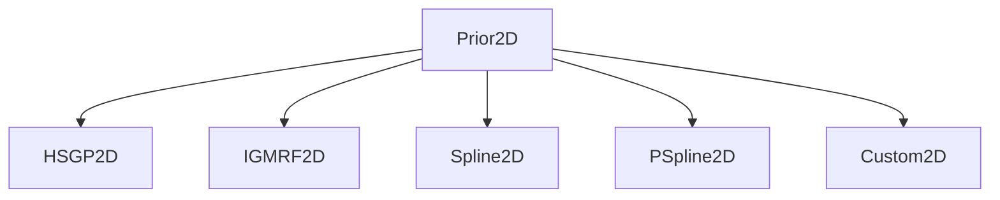

# Dev Docs - Priors

This document outlines how priors for latent contact surfaces are implemented. We employ a hieararchical design to keep the code modular, maintainable, and concise.

## Prior2D
The `Prior2D` class serves as the base class for all 2D priors. It contains common methods and attributes that are shared across different priors.



In a nutshell, all the subclasses of `Prior2D` will sample from a space of matrices representing the latent contact surface. Each prior will have different characters but they essentially give the same type of output:

- For **global** priors the output is a single matrix of dimensions `(A, A)`.
- For **partial** priors the output is a tensor of dimensions `(K, A, A)`, where `K` is the number of stratums.
- For **full** priors the output is a tensor of dimensions `(K^2, A, A)` where `K` is the number of stratums.

The global and partial cases are relatively straight forward. The full case is a bit more involved because in reality we only need to sample $K*(K+1)/2$ matrices from which we can then mirror to get the rest. For a moment, ignore the age dimensions and just think about the first mode representing the stratum combinations. In that case, we can think of the full prior as a symmetric matrix with dimensions `(K, K)`, where each entry corresponds to a stratum combination. The diagonal entries represent within-stratum contacts, while the off-diagonal entries represent between-stratum contacts. To efficiently sample from this space, we only need to sample the lower triangular part of this matrix (including the diagonal). Once we have these samples, we can mirror them to fill in the upper triangular part, ensuring symmetry.

When we vectorise this matrix into a single dimension, we have to make sure that they are ordered correctly. Following standard NumPy ordering, we vectorise it in a row-major fashion. This means that we first take all the elements from the first row (from left to right), then move to the second row, and so on. By doing this, we ensure that the samples are ordered in a way that respects the original matrix structure.

### The Kronecker Sum operation.
Suppose we have two matrices A and B, the Kronecker sum of A and B is defined as:
$$
A \oplus B = A \otimes I_B + I_A \otimes B
$$
where $I_A$ and $I_B$ are identity matrices of sizes equal to the dimensions of A and B respectively, and $\otimes$ denotes the Kronecker product.

Recall that we have samples of tensors of the form $(K^2_k, A, A)$ for $k = 1, \ldots, K^2$. We need to define a Kronecker sum operation that acts only on the first mode of these tensors. 

To achieve this, we can define a custom Kronecker sum function that takes two tensors and performs the Kronecker sum operation on their first modes while keeping the other modes intact. This is how this first mode Kroneker sum can be implemented:
```python
import jax.numpy as jnp

def kron_sum_mode_1(tensor_a, tensor_b):
    K_a, A1, A2 = tensor_a.shape
    K_b, B1, B2 = tensor_b.shape
    
    assert A1 == B1 and A2 == B2, "The spatial dimensions must match."

    result = tensor_a[:, None, :, :] + tensor_b[None, :, :, :]  # (K_b, K_a, A, A)
    
    return result.reshape(K_a * K_b, A1, A2)  # Final shape: (K_a * K_b, A1, A2)
```

We must have a good understanding of how this Kronecker sum allocates the matrices.